# Setting up the character in Unity

This document explains how import in Unity a character created in the main Authoring procedure.

## Prerequisite

[Download the YALLAH SDK](http://www.dfki.de/~fanu01/YALLAH/Releases/), extract the zip, and import the `YALLAH_Unity-yymmdd.unitypackage` package into your Unity project.

The package will add the following folder to your Assets:

```
/YALLAH/
  Characters/
    MBLabFemale/
    MBLabMale/
  Scenes/
    TestMaleBase.unity
    ...
  Scripts/
```

The `Characters` folder contains two basic, naked characters; one male and one female, generated using MBLab and the default body proportions. 

The `Scenes` folder contains Test scenes that put both characters in a minimalistic demo stage. They are stress tests activating all functionalities at the same time. Don't be surprised if the characters look psychotic.

The `Scripts` folder contains the _Motion Controllers_ of the characters, i.e., the scripts enabling their interactive animation. 

The rest of this document explains the procedure to apply the scripts to a freshly imported character.

## Add the Blender Scene to your Assets

* Copy the character scene (e.g., `Anna.blend`) into a dedicated directory, e.g.: `MyUnityProject/Assets/Characters/Anna/`

* Export the textures as files into Unity Assets
  - Use Blender to open the scene that you copied into your Assets folder (e.g.: `/Assets/Characters/Anna/Anna.blend`)
  - Menu: `File -> External data -> Unpack All Into Files`
  - On pop-up select: `Write files into current directory (Overwrite existing files)`
  - A directory named `textures` will be created. e.g.:
  
    ```
    /Assets/BlenderScenes/Anna/textures/
      human_female_diffuse.png
      human_female_displacement.png
      Tops_Diffuse.png
      Shoes_Diffuse.png
      ...
    ```

TODO -- check if it is possible to retain also the Normal-textures.

Actually, you can delete the textures named `human_[fe]male_diffuse/Displacement.png` because they are the same for each character.
You can avoid replications and find a copy of them under `Scripts/mesh_utils/MBLab_textures`.

## Configure textures import options


For each image in the newly created `texture` directory:
* Do not import the alpha channel for diffuse textures
* Set the image type to "normal map" for normal map textures.

TODO -- For each piece of clothes you have to take the textures from the original OBJ or DAE object.
Manually edit the materials: 
* Albedo: set the diffuse texture
* Albedo color: (255,255,255,255)
* Normal Map: set the normal texture


## Configure Import settings


Select the prefab model `/Assets/YALLAH/Characters/Anna/Anna.blend` and in the inspector, configure:

 * `Import Settings -> Model -> Normals -> Calculate`

   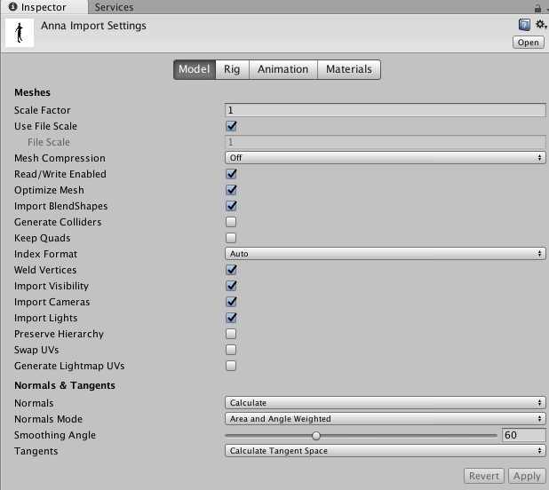

 * `Import Settings -> Rig`
   - `Animation Type Generic`
   - `Root node: XXXArmature` (the parent of the _root_ node)

   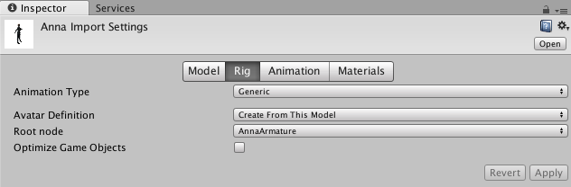

 * `Import Settings -> Animation`
   - (Important for locomotion)
   - Check `Loop Time` for each animation that has to loop (e..g, _WalkCycle_, _TurnLeft_ and _TurnRight_)
   - Check the flag `Root Transform Rotation` for every animation that is NOT supposed to rotate the character (e.g., _Idle_, _WalkCycle_)
     - This avoid for example that a character WalkCycle steers on a side because of accumulation of errors.
   - Check the flag `Root Transform Position (Y)` for every animation that is NOT supposed shift the character vertically (e.g., _Idle_, _WalkCycle_, _TurnLeft/Right_)
     - This avoids for example that an error accumulation lifts the character in the sky while looping an Idle animation
   - Check the flag `Root Transform Position (XY)` for every animation that is NOT supposed translate on the horizontal plane (e.g., _Idle_, _Wave Hello_)
     - This avoids for example that an error accumulation slides the character on the floor.
   - Please, see the [Unity manual on Root Motion](https://docs.unity3d.com/Manual/RootMotion.html) to understand the details.

   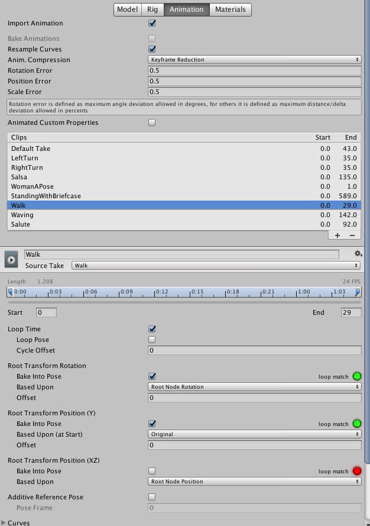

 * Manually fix some materials
   - By default, the materials are embedded in the character. But embedded materials are not editable. Unfortunately, we have to extract the materials and perform some manual operation.
   - Leave `Import Settings -> Materials -> Location: Use Embedded Materials`
   - **Click** `Import Settings -> Materials -> Extract Materials...` and put them in the same folder with the blend file.

   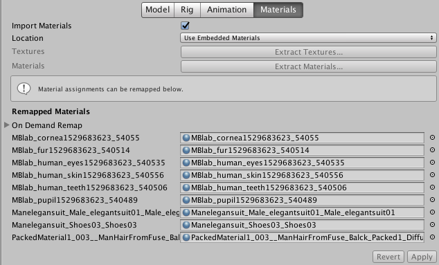


## Add a character

Put a character in the scene, e.g., by dragging the `Anna.blend` asset in the Hierarchy Window.

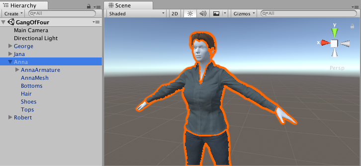

## Fix the materials (Mesh Script)

This script will automatically adjust the materials of the character when you Start the game. In other words, when starting the game (Play), the script is procedurally performing some operation that you would need to perform by hand on every character you import in the scene.

* Select the Mesh Game Object (e.g., `AnnaMesh`) (expand Object `Anna`, if needed)
* In the inspector `Add Component`: `FixMLabMaterials.cs`.
* From `Assets/Scripts/mesh_utils/MBLab_textures` drag the 3 following textures in the corresponding slots
  - `human_[fe]male_diffuse`
  - `human_[fe]male_displacement`
  - `eyelashes_[fe]male_diffuse`

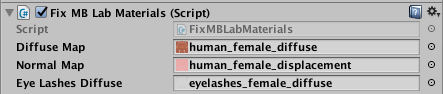

The diffuse and displacement textures are taken directly from the MBLab character generator.
The eyelashes textures have been created from the diffuse ones in order to better render the eyelashes with the standard Unity shader in _Fade_ mode.

Unfortunately, _cornea_ and _fur_ (eyelashes) must be fixed manually, as described in the two following sections.

(The FixMLabMaterials.cs script already has the code to fix the issue, but looks like it doesn't work when exporting.)

### Fix Cornea

* **Select** the Mesh
* In the inspector, locate material `MBlab_cornea`
* `Shader: Standard (Specular setup)`
* `Rendering Mode: Transparent`
* `Albedo texture: eyelashes_[fe]male_diffuse`
* `Albedo color: (255,255,255,12)`
* `Specular color: (25,25,25,255)`
* `Smoothness: 0.85`
* `Source: Specular Alpha`
* `Specular Highlights: off`
* `Reflections: on`


### Fix Eyelashes

* **Select** the Mesh
* In the inspector, locate material `MBlab_fur`
* `Shader: Standard (Specular setup)`
* `Rendering Mode: Fade`
* `Albedo texture: eyelashes_[fe]male_diffuse`
* `Albedo color: (255,255,255,255)`
* `Specular color: (51,51,51,255)`
* `Smoothness: 0`
* `Source: Specular Alpha`
* `Specular Highlights: off`
* `Reflections: off`


## Scripts for interaction with MaryTTS

* **Select** the Mesh (e.g., `AnnaMesh`)
* In the inspector `Add Component`: `MaryTTSController.cs`.

  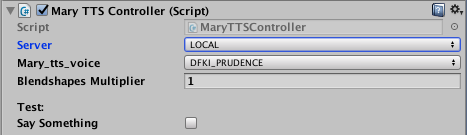

The script `YALLAH/Scripts/tts/MaryTTSController.cs` uses [MaryTTS](http://mary.dfki.de/) as web service.

The controller sends the sentence text and gets back a WAV file and the _realized durations_ (a table with timecode-phoneme pairs).
This architecture might introduce delays of the server is slow to respond. It is advised to install MaryTTS on your local machine if quick reactions to speech orders must be guaranteed. 


## Eye Blinking

* **Select** the Mesh (e.g., `AnnaMesh`)
* In the inspector `Add Component`: `EyeBlinkController`.

No configuration is needed. The character will blink at irregular intervals.


## Eye gaze

* **Select** the Mesh (e.g., `AnnaMesh`)
* In the inspector `Add Component`: `Eye Head Gaze Controller`.

Select/drag the following bones from the Armature hierarchy (e.g., expand `AnnaArmature`) in the configuration panel:
* Left Eye
* Right Eye
* Neck

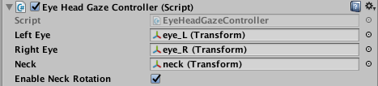


## Script for changing Facial Expressions
Facial expressions are originally created as blendShapes in Blender and then as components of the character, they are imported to Unity. In Unity, you can find them in the inspector of the imported mesh under the title of "Skinned Mesh Renderer" as "Blend Shapes".
The script `SetExpressionValues.cs` provides the possibility to change the facial expressions in the inspector or while running (by pushing some buttons)

How to use:
1. Add the code (`SetExpressionValues.cs`) as component of the mesh.
2. For writing the title of each shot while running, just add a text_object to this part of the inspector. (Note: Better to add text_objects as part of the Canvas and GUI)
3. Now, To make the buttons work, add the mesh to dedicated part (on click) of the intended button and then in the pull_down menu beside it, choose this code and name of related function of the code that you expect to be performed by pushing the button (e.g. SetExpressionValues.previousExpression).

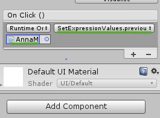

## Script for playing back animations

Select the avatar in the Scene (e.g., Anna), where an `Animator` component is created by default.
Configure:
* `Controller: Scripts/animation/CharAnimationController`

Add the script component `AnimationController.cs` to the character's main object (e.g., Anna).
Configure:
* `Enable Ambient at start`: the ambient animation will be enabled when the game starts (Suggested option).
* `IdleAmbientAnimationClip`: select a clip where the character is standing and slightly moving, in order to remove the "puppet" effect.
* `StaticPoseAnimationClip`: select a clip where the character is just standing in a static neutral position, like the reference A-pose.
* `AnimationClips`: insert the number of clips you want to support and drag them into the editor panel.
  - For each slot, drag an animation clip, from the character `AnnaAvatar` or another you want.
* Locomotion (You can skip if you don't add the locomotion controller):
  - `Walk Cycle`: A loopeble animation with a walking cycle.
  - `Turn Right`: A loopable animation stepping and rotating to the right.
  - `Turn Left`: A loopable animation stepping and rotating left.
  - The three animations must be synchronized in time, i.e., the animations must have the same duration and
    the feet must touch the floor at the same timestamp.

Add script component `LocomotionController.cs` to the character's main object.

To test the locomotion insert the coordinates of the target destination and click on the `Force Start` checkbox.


## Script for Repositioning the camera
Between the standard shots, we chose five of them to be integrated. They are "FULL_SHOT", "MEDIUM_SHOT", "MEDIUM_CLOSE_UP", "FULL_CLOSE_UP" and "EXTREME_CLOSE_UP".

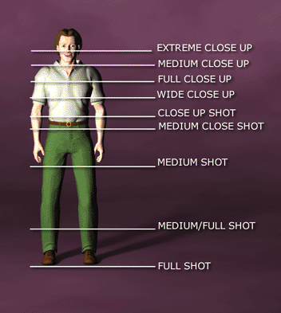

The user can switch the shots on the GUI.

The script `camera/CameraPositioner.cs` repositions the camera for each shot.

For repositioning the camera, we calculate distance of the camera to the character and the height of camera. In all shots, the camera is always horizontally aligned.

As you may see in the picture, height of the frame is a sum of:
1. the part of the body that is in the frame
2. The bottom of the frame
3. The top margins of the frame

`Frame_Height = (Bottom_Margin + Top_Margin) * Frame_Height  + Height`

Distance is calculated using tangent of the camera's FOV:
`Distance = Frame_Height / Tan(Camera_FOV * 0.5)`

As the camera is horizontally aligned, it should be positioned symmetrically in the middle of the frame. Thus height of camera is the mean of heights of top and bottom of the frame:

`Camera_Height = (height of the Frame_Bottom + height of the Frame_Top) * 0.5`

`Camera_Height = [(Body_Top + Top_Margin * Height) + (Body_Button - Button_Margin * Height)] / 2`

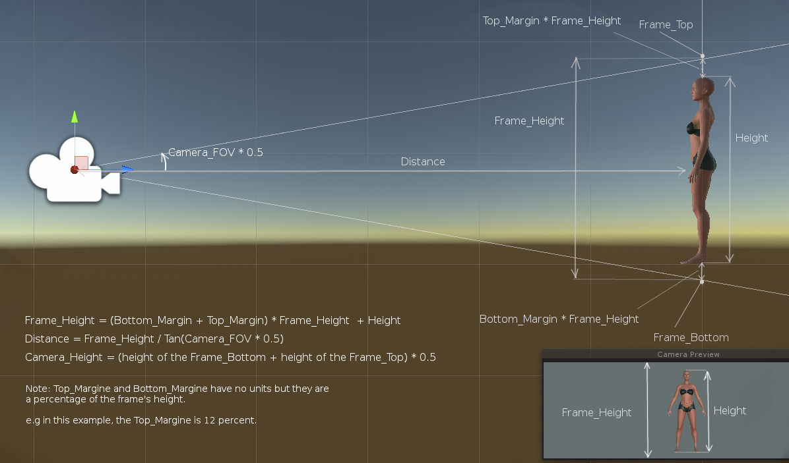

# User interface panel (Canvas_UI)
Canvas_UI consists of buttons and texts of the user interface panel with a background image and an additional game object named UI_controller. The functionality of the UI controller is defined in its attached script (`UI_controller.cs`).

By placing a sample of the prefab of Canvas_UI in the scene, its internal setup is already defined and we need to just define two parameters in its inspector:  mesh of the target character (Target Character Mesh) and the Active Camera.

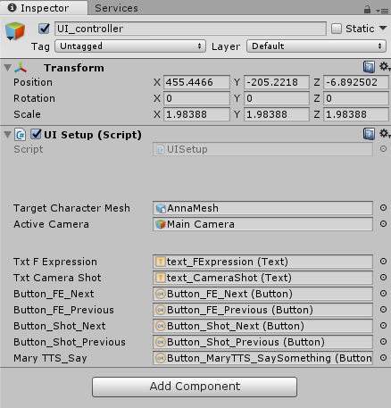

## Setup of the Canvas_UI
The setup is done by predefined Inspector of the Canvas_UI under the "Canvas Scaler". In the current setup, we made the UI setup as you can see in the image. It is chosen that UI scales with the screen size. In this setup, the UI size is scaled according to just the canvas height (Match slider). As a result by adjusting just the Y part of the "Reference Resolution", it is possible to scale size of the UI.

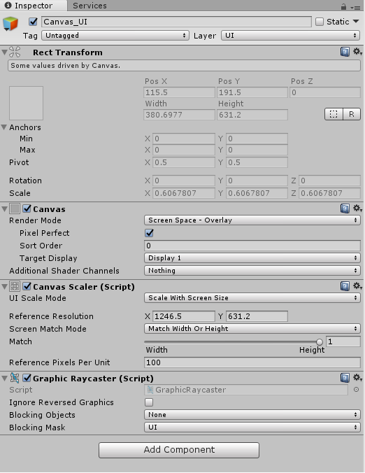


# Modifying Hair mesh in Unity (imported from Blender)
To make the hair mesh in Unity, first we need to make the Albedo which is  the diffuse file which has opacity file as alpha channel. Then modify the hair material and apply hair texture.

## Adding the Opacity file as an Alpha channel of the Diffuse file
This works fine with GIMP 2.8. Open the Diffuse file. Then open the Opacity file as a new layer (File -> Open as Layers). Put this new layer as the highest layer. Delete alpha channels if exist. With the Opacity layer selected press ctrl+a to select the whole layer and then press ctrl+c to copy it. Then right click on the Opacity layer and choose "add layer mask". In the opened menu choose "Gray scale copy of layer" and click the "add" button. Click on the created mask and press ctrl+v to paste the copied texture in the mask.

Then right click on the Diffuse layer and repeat the same steps but this time select "White(full opacity)" to create a mask on this layer. Then click on the mask of the Opacity layer, press ctrl+a and then ctrl+c. Then click on the mask of the Diffuse layer and press ctrl+v to paste.

Now you have everything in the Diffuse layer and you can delete the Opacity layer.

You can see a video in the following link:
`https://www.youtube.com/watch?v=pGPJhT5lUpE`

## Modification of hair shader
Normally the hair has a standard shader. First add the texture which has alpha-channel to the shader and set the rendering mode  to `Cutout`.

Two codes are attached to the hair object:

`DoubleFaceMesh.js` makes the hair visible from both sides.
`MeshInst.cs` creates an instance of  `SkinnedMeshRenderer` over which the `DoubleFaceMesh.js` operates. In this way we may avoid memory overflow of making multiple vertices and normals.
