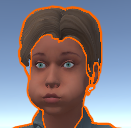
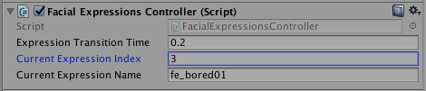
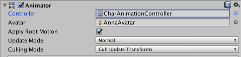
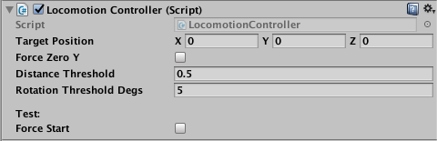

# Setting up the character in Unity

This document explains how import in Unity a character created in the main Authoring procedure.

## Prerequisite

[Download the YALLAH SDK](http://www.dfki.de/~fanu01/YALLAH/Releases/), extract the zip, and import the `YALLAH_Unity-yymmdd.unitypackage` package into your Unity project.

The package will add the following folder to your Assets:

```
/YALLAH/
  Characters/
    MBLabFemale/
    MBLabMale/
  Scenes/
    TestMaleBase.unity
    ...
  Scripts/
```

The `Characters` folder contains two basic, naked characters; one male and one female, generated using MBLab and the default body proportions. 

The `Scenes` folder contains Test scenes that put both characters in a minimalistic demo stage. They are stress tests activating all functionalities at the same time. Don't be surprised if the characters look psychotic.

The `Scripts` folder contains the _Motion Controllers_ of the characters, i.e., the scripts enabling their interactive animation. 

The rest of this document explains the procedure to apply the scripts to a freshly imported character.

## Add the Blender Scene to your Assets

* Copy the character scene (e.g., `Anna.blend`) into a dedicated directory, e.g.: `MyUnityProject/Assets/Characters/Anna/`

* Export the textures as files into Unity Assets
  - Use Blender to open the scene that you copied into your Assets folder (e.g.: `/Assets/Characters/Anna/Anna.blend`)
  - Menu: `File -> External data -> Unpack All Into Files`
  - On pop-up select: `Write files into current directory (Overwrite existing files)`
  - A directory named `textures` will be created. e.g.:
  
    ```
    /Assets/BlenderScenes/Anna/textures/
      human_female_diffuse.png
      human_female_displacement.png
      Tops_Diffuse.png
      Shoes_Diffuse.png
      ...
    ```

TODO -- check if it is possible to retain also the Normal-textures.

Actually, you can delete the textures named `human_[fe]male_diffuse/Displacement.png` because they are the same for each character.
You can avoid replications and find a copy of them under `Scripts/mesh_utils/MBLab_textures`.

## Configure textures import options


For each image in the newly created `texture` directory:
* Do not import the alpha channel for diffuse textures
* Set the image type to "normal map" for normal map textures.

TODO -- For each piece of clothes you have to take the textures from the original OBJ or DAE object.
Manually edit the materials: 
* Albedo: set the diffuse texture
* Albedo color: (255,255,255,255)
* Normal Map: set the normal texture


## Configure Import settings


Select the prefab model `/Assets/YALLAH/Characters/Anna/Anna.blend` and in the inspector, configure:

 * `Import Settings -> Model -> Normals -> Calculate`

   

 * `Import Settings -> Rig`
   - `Animation Type Generic`
   - `Root node: XXXArmature` (the parent of the _root_ node)

   

 * `Import Settings -> Animation`
   - (Important for locomotion)
   - Check `Loop Time` for each animation that has to loop (e..g, _WalkCycle_, _TurnLeft_ and _TurnRight_)
   - Check the flag `Root Transform Rotation` for every animation that is NOT supposed to rotate the character (e.g., _Idle_, _WalkCycle_)
     - This avoid for example that a character WalkCycle steers on a side because of accumulation of errors.
   - Check the flag `Root Transform Position (Y)` for every animation that is NOT supposed shift the character vertically (e.g., _Idle_, _WalkCycle_, _TurnLeft/Right_)
     - This avoids for example that an error accumulation lifts the character in the sky while looping an Idle animation
   - Check the flag `Root Transform Position (XY)` for every animation that is NOT supposed translate on the horizontal plane (e.g., _Idle_, _Wave Hello_)
     - This avoids for example that an error accumulation slides the character on the floor.
   - Please, see the [Unity manual on Root Motion](https://docs.unity3d.com/Manual/RootMotion.html) to understand the details.

   

 * Manually fix some materials
   - By default, the materials are embedded in the character. But embedded materials are not editable. Unfortunately, we have to extract the materials and perform some manual operation.
   - Leave `Import Settings -> Materials -> Location: Use Embedded Materials`
   - **Click** `Import Settings -> Materials -> Extract Materials...` and put them in the same folder with the blend file.

   


## Add a character

Put a character in the scene, e.g., by dragging the `Anna.blend` asset in the Hierarchy Window.


## Fix the materials (Mesh Script)

This script will automatically adjust the materials of the character when you Start the game. In other words, when starting the game (Play), the script is procedurally performing some operation that you would need to perform by hand on every character you import in the scene.

* Select the Mesh Game Object (e.g., `AnnaMesh`) (expand Object `Anna`, if needed)
* In the inspector `Add Component`: `FixMLabMaterials.cs`.
* From `Assets/Scripts/mesh_utils/MBLab_textures` drag the 3 following textures in the corresponding slots
  - `human_[fe]male_diffuse`
  - `human_[fe]male_displacement`
  - `eyelashes_[fe]male_diffuse`


The diffuse and displacement textures are taken directly from the MBLab character generator.
The eyelashes textures have been created from the diffuse ones in order to better render the eyelashes with the standard Unity shader in _Fade_ mode.

Unfortunately, _cornea_ and _fur_ (eyelashes) must be fixed manually, as described in the two following sections.

(The FixMLabMaterials.cs script already has the code to fix the issue, but looks like it doesn't work when exporting.)

### Fix Cornea

* **Select** the Mesh
* In the inspector, locate material `MBlab_cornea`
* `Shader: Standard (Specular setup)`
* `Rendering Mode: Transparent`
* `Albedo texture: eyelashes_[fe]male_diffuse`
* `Albedo color: (255,255,255,12)`
* `Specular color: (25,25,25,255)`
* `Smoothness: 0.85`
* `Source: Specular Alpha`
* `Specular Highlights: off`
* `Reflections: on`


### Fix Eyelashes

* **Select** the Mesh
* In the inspector, locate material `MBlab_fur`
* `Shader: Standard (Specular setup)`
* `Rendering Mode: Fade`
* `Albedo texture: eyelashes_[fe]male_diffuse`
* `Albedo color: (255,255,255,255)`
* `Specular color: (51,51,51,255)`
* `Smoothness: 0`
* `Source: Specular Alpha`
* `Specular Highlights: off`
* `Reflections: off`


### Fix the Hair

* Select the `_DiffuseWithAlpha.png` texture:
* In the inspector, **enable** `Alpha Is Transparency`
* **Select** the `Hair` Mesh.
* Set the `Albedo` texture to `_DiffuseWithAlpha.png`.

Now, according to the hair model, you have two options to fix the material properties.

**Option 1**: Nice transparency, bad visibility.

* Set `Rendering Mode` to `Fade`

The transpareny will be nice, but if you look the hair from inside the head, the backface culling will let you see outside the head.
With some hair model and camera angles, this is not acceptable.


**Option 2**: Bad transparency, good visibility.

* Set `Rendering Mode` to `Cutout`
* Set `Alpha Cutoff` to a vale as low as `0.01`
  - This will at least adjust the rendering of hair tips
* `Add Component -> ` `DuplicateMeshFaces.cs`
  - It will enable the visibility of the polygons from both sides after starting the game.


_The `DuplicateMeshFaces.cs` doesn't work properly with transparent materials._

## Scripts for interaction with MaryTTS

* **Select** the Mesh (e.g., `AnnaMesh`)
* In the inspector `Add Component`: `MaryTTSController.cs`.

  

The script `YALLAH/Scripts/tts/MaryTTSController.cs` uses [MaryTTS](http://mary.dfki.de/) as web service.

The controller sends the sentence text and gets back a WAV file and the _realized durations_ (a table with timecode-phoneme pairs).
This architecture might introduce delays of the server is slow to respond. It is advised to install MaryTTS on your local machine if quick reactions to speech orders must be guaranteed. 


## Eye Blinking

* **Select** the Mesh (e.g., `AnnaMesh`)
* In the inspector `Add Component`: `Eye Blink Controller`.

No configuration is needed. The character will blink at irregular intervals.


## Eye gaze

* **Select** the Mesh (e.g., `AnnaMesh`)
* In the inspector `Add Component`: `Eye Head Gaze Controller`.

Select/drag the following bones from the Armature hierarchy (e.g., expand `AnnaArmature`) in the configuration panel:
* Left Eye
* Right Eye
* Neck


## Script for changing Facial Expressions

* **Select** the Mesh (e.g., `AnnaMesh`)
* In the inspector `Add Component`: `Facial Expression Controller`.

The script `YALLAH/Scripts/facial_expressions/FacialExpressionsController.cs` scans the list of BlendShapes (aka ShapeKeys, in Blender terminology)
and makes alist of all blend shapes beginning with the `fe_` prefix.

The Basic set of expressions is automatically extracted from the Manuel Bastioni Lab default character.
If you want to add more expressions to this Controller, simply create your own in Blender and name them with a `fe_` prefix.

The controller add a "Normal" facial expression to the list of the `fe_xxx`.
The normal expression is indexed as 0, all the remaining are numbered from 1 onwards.

At run time, you can manually input the facial expression number in the `Current Expression Index`.





## Script for playing back animations

* **Select** the avatar root GameObject (e.g., `Anna`)
* In the inspector, locate the `Animator` component and select `Controller: /YALLAH/Scripts/Animation/CharAnimationController.controller`.
  
* In the inspector `Add Component`: `Animation Controller`.

The Animation Controller script (`YALLAH/Scripts/animation/CharAnimationController.cs`) centralizes a set of animation and their role,
avoiding the need to have a Animation Overrider or the need to create a different controller (State Machine) for each character.

Configuration:
* `Enable Ambient at start`: the ambient animation will be enabled when the game starts (Suggested option).
* `Idle Ambient Animation Clip`: select a clip where the character is standing and slightly moving, in order to remove the "puppet" effect.
* `Static Pose Animation Clip`: select a clip where the character is just standing in a static neutral position, like the reference A-pose.
* `AnimationClips`: insert the number of clips you want to support and drag them into the editor panel.
  - For each slot, drag an animation clip, e.g., from the asset `/YALLAH/Characters/Anna/Anna(.blend)/Salsa`.
  - At runtime, you can click on `Play Random Anim` to play a random animation from this list.
* Locomotion (You can skip these if you don't add the locomotion controller. See next section):
  - `Walk Cycle`: A loopable animation with a walking cycle.
  - `Turn Right`: A loopable animation stepping and rotating to the right.
  - `Turn Left`: A loopable animation stepping and rotating left.
  - The three animations must be ideally synchronized in time, i.e., the animations must have the same duration and
    the feet must touch the floor at the same timestamp.


_Restriction: the animation clips for a character must be picked from the same blender scene prefab.
At the moment, it is not possible to use the animation clips of a charater across other characters, even if the skeletal structure is the same.
This causes a waste of memory. We will investigate how to optimize the management of the animations and reduce memory footprint._


## Script for Locomotion

* **Select** the avatar root GameObject (e.g., `Anna`)
* In the inspector `Add Component`: `Locomotion Controller`.



The script `YALLAH/Scripts/animation/LocomotionController.cs` allows the character to walk to a target destination.

Configure:
* `Target Position` shows where the character would like to walk to.
* `Force Zero Y` is needed to force the avatar game object to y=0, in case the animations have a vertical drift.
* `Distance Threshold` the character will stop walking when he reaches this distance from the target. Too small values might lead to an infinite attempt to reach the target.
* `Rotation Threshold Degs` tolerance, in degrees, in the alignment with the target. Too small values might lead to infinite attempts to orient towards the target.

To test the locomotion, at runtime, manually insert the coordinates of the `Target Position` and click on the `Force Start`.
