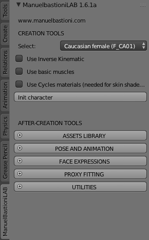
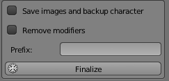
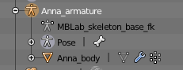
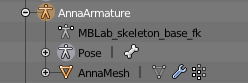
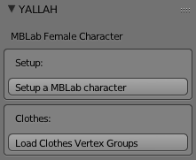
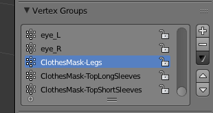

# Project YALLAH - Authoring a Virtual Character

This document is a chapter of the [YALLAH Manual](Manual%20-%20Main.md) series.
In this chapter we describe how you can use the YALLAH system to create a new virtual character.
Please, refer to other chapters to learn how to deploy virtual characters in real-time engines like the Blender Game Engine and Unity.

This chapter assumes that the author has a basic knowledge of the Blender 3D authoring software,
in particular how to configure the layout of the GUI, select objects, investigate properties, and load and execute scripts.
To start with the use of Blender you can watch the [Official Blender tutorials on Youtube](https://www.youtube.com/watch?v=kes2qmijy7w&list=PLa1F2ddGya_8V90Kd5eC5PeBjySbXWGK1) 

YALLAH consists of a selection of open-source tools and a set of scripts that, altogether, enable for the generation of a new virtual character _in less than 1 hour_.
  * The produced character will be ready to be embedded in real-time engines.

The process is divided in three steps.

The _first step_, **Character Generation**, consists of creating a new character using the ManuelBastioniLAB add-on for Blender.

The _second step_, **Character Customization**, consists of adapting a character in the Blender game engine. _Adapting_ means fixing materials and adding blend shapes and/or bones needed at runtime for extra functionalities.

The _third step_, **Character Configuration**, consists of configuring the character for real-time execution. In Blender, it means configuring the invocation of some scripts from the Game Logic.
In Unity, it means importing the character in Unity, adjusting the import settings, and attach a set of Scripts to the correct Unity GameObjects.

Both the second and the third steps consist of several sub-steps. Some are *mandatory*, some others are *optional* -- needed only if you plan enable specific functionalities.
For example, in order to enable the Text-to-speech functionality, you need to customize the character (run a Blender script) to create the visemes of the character. Afterwards, in Unity, you need to attach a C# script as component to the character Mesh.

In this document we describe only the mandatory steps, which are needed to correctly see the character in the real-time engine, without functionalities.
The optional sub-steps are described in the document associated to the specific functionality that you want to enable.

# Character Creation

Creating a new virtual character for the project DECAD involves several steps.
The first consists in creating a new character with the software ManuelBastioniLAB, which is a Blender plugin.
Then, a set of scripts must be executed. Each script fixes a specific aspect of the character data (skeletal structure, Shape Keys, ...) as required by the various functionalities (e.g., eye-gaze, talking, ...).

## Install the prerequisites

* Install the [Blender](https://www.blender.org/) 3D authoring software (tested with **v2.79b**).

* Install the [ManuelBastioniLab](http://www.manuelbastioni.com/) (tested with [**v1.6.1a**](http://download.tuxfamily.org/manuellab/manuelbastionilab_161a.zip)) addon for Blender and enable it.

(To learn how to install Blender addons, you can watch this video: https://www.youtube.com/watch?v=5xqi_uyhQrM)

* Download the [YALLAH_SDK-yymmdd.zip](http://www.dfki.de/~fanu01/YALLAH/Releases) and extract it;
* Install and enable the `yallah` Blender add-on.

## Choose a name

Choose a name for your character.
If this example we will follow with the name `Anna`.

## Customize your character

At this point, you can take advantage of the ManuelBastioniLAB tool
 to customize the size and proportions of your character.
This is an artistic job. It's your job. How to do it is out of the scope of this document.
Please, refer to the Manuel Bastioni LAB [documentation](http://www.manuelbastioni.com/guide_manuellab_index.php)
 to learn how to customize the character.

## Generate the character

* Create a character using ManuelBastioniLab.

  
  * In the 3D View, locate the tab `ManuelBastioniLAB` in the (left) tool panel
  * **Select** `Cuacasian female` (F_CA01)
    * (Also `Caucasian male` (M_CA01) is supported)
  * **Uncheck** the option `Use Cycles materials`
  * **Click** `Init character`
  * Go to the `Rest pose` tab
	   * Make sure that the Rest pose is set to `a-pose`
* Finalize the character.
   * Go to the `Finalize tools` tab
   * **Uncheck** `Save images and backup character`
   * **Uncheck** `Remove modifirers`
   * **Click** `Finalize`
   
   
* Rename scene objects:

  
  
  - Recall the name you want to give to your character, e.g.: `Anna`
  - **Rename** the _Armature_ object from something like _MBlab_sk1527065084.664746_ into `AnnaArmature`
  - **Rename** the contained mesh from something like _MBlab_bd1527065084.664721_ to `AnnaMesh`
  - (Game scripts need these conventions to refer to objects)

_P.S.: It is very important that you **do not** save the Blender scene with the same name of the Armature object.   
If you name, e.g. the scene `Anna.blend` and the armature `Anna`, Unity is going to mess up with the animation system!_

At this point you can already save the scene (e.g., as `Anna.blend`) with this immobile and naked character,
 and reuse it later if you want to apply different clothes and/or animations.

## Setup the character

We offer a big `Setup Operator` performing several automated editing operations on your generated character.
After the execution, the character will be ready to be used in a real time engine
 (like Unity, or the Blender Game Engine)

The editing operations include adding bones and blendshapes (needed by the motion controllers), and adjusting material definitions (the latter, to support real time rendering).

* Go to the `Yallah` tools panel
* **Select** the mesh object (e.g., `AnnaMesh`)
* **Click** on `Setup a MBLab character`

  

For those who need to skip some of the Setup steps, or add new ones (and know what they are doing),
 the following subsections document all the steps performed by the Setup.
If you don't need special customizations or optimization, just skip it.
(However, if you want to contribute to the YALLAH project, you better read it.)

### (Setup) Fix the materials

This step is needed for real-time render in Blender and for good export of the character to Unity.
By default, MBLab materials are tuned for off-line rendering; so we fix them with an operator.

* **Select the mesh object** (child of the armature) and stay in Object Mode.
* Load and Run the script `Features/RealTimeMaterials/Setup.py`
  - It runs operator: **Bastioni TTS Fix Materials** `bpy.ops.object.bastioni_tts_fix_materials()`

### (Setup) Create the visemes for integration with MaryTTS

Creates the ShapeKeys for the phonemes.

* **Select** the mesh object (child of the armature) and stay in Object Mode.
* Load and Run the script `Features/MaryTTS/Setup.py`
  - The phonemes are taken from MBLab 1.6 and defined as mix of the basic ShapeKeys.
  - The definition of the phonemes is stored in file `Features/MaryTTS/PhonemesMBLab1_6.json`.
  - This is done through the **Create ShapeKeys from File** operator:
   `bpy.ops.object.create_shape_keys(shape_keys_filename="Features/MaryTTS/PhonemesMBLab1_6.json")`

### (Setup) Create the Facial Expressions

Create the ShapeKeys for the Facial Expressions, each starting with 'fe_'.

* **Select** the mesh object (child of the armature) and stay in Object Mode.
* Load and Run the script `Features/FacialExpressions/Setup.py`
  - The expressions are taken from MBLab 1.6 and defined as mix of the basic ShapeKeys.
  - This is done through the **Create ShapeKeys from File** operator:
 `bpy.ops.object.create_shape_keys(shape_keys_filename="Features/FacialExpressions/FacialExpressionsMBLab1_6.json")`

### (Setup) Eye bones

The following script will setup bones to pilot the eyes of the character.
Actually, the bones will not be used to rotate the eyes (MBLab does it using ShapeKeys),
 but rather to query the position of the pupils in order to direct the gaze.

* **Select** the mesh object (child of the armature) and stay in Object Mode.
* Load and Run the script `Features/EyeGaze/Setup.py`

### (Setup) Camera requirements

The following script will setup a bone at top of the character's head.
 It is useful to adjust the distance and position of a camera according to a requested shot type
 (e.g., full shot or extreme close-up).

* **Select the mesh object** (child of the armature) and stay in Object Mode.
* Load and Run the script `Features/Camera/Setup.py`

### (Setup) Remove the surface subdivision Modifier

It prevents the importation of the ShapeKeys in Unity.
The code to remove the modifier (4 lines) essentially removes from the object the modifier named `mbastlab_subdvision`.

## Import clothes (Optional)

TODO -- update names with actual asets and take screenshots

Clothes are available in external blender scenes.
You can find those scenes in the `YallahAssets-yymmdd.zip` archive under `YallahAssets/Clothing`.

Import the clothes by appending the objects from the Blender scene.
For each piece of clothes you want to add:
* Import the clothes:
  - From the menu **Select** `File --> Append`
  - Locate and **Select** the scene containing the clothes (e.g.: `Woman_ClothingSet01-20180524.blend`)
  - Once in the scene (remember, a _.blend_ file is seen as a directory), **enter** the `Object` directory
  - **Select** the piece of clothes you want to add (e.g., `Bottoms` , or _Tops_, _Shoes_, ...)
  - **Click** `Append from Library`
* Configure the clothes:
  - Set the parent of the clothe object (e.g., `Bottoms`) to the Armature object (e.g., `Anna`)
  - **Add an Armature modifier** to the Bottoms.
    - **Set** the target armature, e.g., `Object: Anna`
* Fit the clothes to the character:
  - Open the `ManuelBastionLIB` tab and the panel `AFTER-CREATION TOOLS -> PROXY FITTING`
  - **Select** the `Character` mesh (e.g., `AnnaMesh`)
  - **Select** the piece of clothes as `Proxy` (e.g., `Bottoms`)
  - Leave `Offset: 0` and `Influence: 20`
  - **Select** `Fit Proxy`
  - By selecting the armature in Pose mode, you can verify that now the clothes move together with the body.
* Repeat for each piece of clothes you want to add.

## Remove unneeded vertices

TODO -- take screenshots

While animating the character, some skin might get out of the clothes.
In this case it is better to remove the vertices under the clothes.
It has the double advantage to avoid skin-clothes compenetration and increases the rendering performances.

* **Select** the mesh object (e.g., `AnnaMesh`) 
* **Go to** the Yallah panel and **Click** `Load Clothes Vertex Groups`

  

* **Enter edit mode** and use the vertex groups to quickly select the vertex type that you want to delete.
* **ATTENTION!** According to the type of clothes that you use, more or less vertices must be deleted. Very likely, you **MUST** manually customize the vertex selection.

(It is also possible to take advantage of MBLab automatic vertex masking system, which automatically detects the vertices under the clothes.
But in this case you will delete only a limited set of vertices.)

## Import animations (Optional)

TODO -- update with actual assets

We have a number of animations that can be imported into the newly created character.
These animations are stored in separated Blender scenes and can be imported by _appending_ Actions.

* From the menu **Select** `File --> Append`
* Open an animation file, e.g., `Woman_AnimationSet1.blend`
* Enter the `Action` folder
* Import some basic animations:
  - IdleSlowBreath
  - Salsa
  - Waving
  - APose
* For each Action you must force the Action to stay in the scene
  - Dope Sheet --> Action Editor --> select each animation -> Click F

## Pack and Save

* Bring all textures inside the Blend file.
  - Pack data: `File -> External Data -> Pack All Into .blend`

* Save the scene with a filename corresponding to the name you chose for the character.
  - E.g.: Save to `Anna.blend`

## Final Remarks
At this point the Blender scene in ready to be imported in a Game Engine.
See the next guide [Manual - Authoring - Unity Deploy](Manual%20-%20Authoring%20-%20Unity Deploy.md) to use the created character in the Unity Game Engine.
