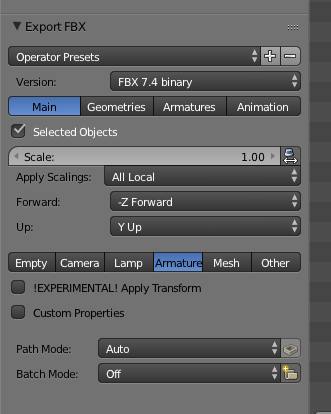
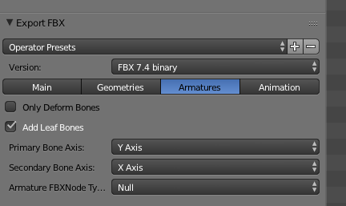
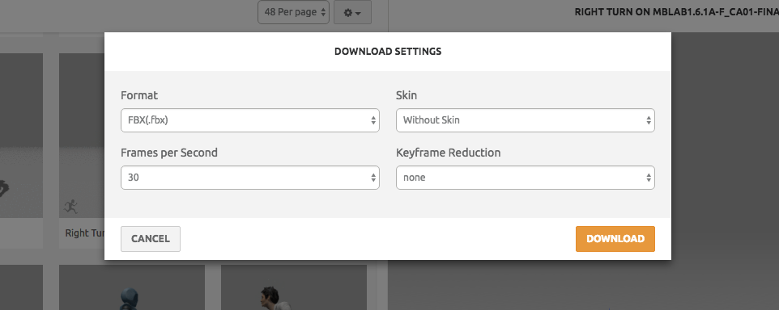

# Import of Animations from Adobe Mixamo to Blender

I describe the pipeline for importing animations from Adobe Mixamo in a way that they can be applied to the Manuel Bastioni (MB) characters.

1. Create a character and export it as FBX.

   Note: There is already a sample of such exported FBX file (`MBLab1.6.1a-F_CA01-finalised-armature.fbx`) that
   you could use it immediately to import in MIXAMO. In this case you may skip these steps.

   * Open a new Blender scene. Create a MB character and configure it as you need.
   * Before finalizing the character, reset the character (MBLab->'Pose and animation'->'reset pose and animation'). This resets the character to A-Pose.
   * Finalize the character in A-Pose
   * Select the character in Object mode and run `MBCharResetOrientation.py`.
     You need to do this because most of the time Bones' orientations of the created characters
      are not accurately reset and this increases mismatch between the created character and imported animation from MIXAMO.

      Note: If you save the scene and reopen it, there would be again some non-zero orientations and we recommend to run  the `MBCharResetOrientation.py` each time before export.
   * Export the character's armature in FBX format.
     Select the armature and select
     `File -> Export -> FBX (.fbx)`
     
     

2. Upload the character to MIXAMO
   * Upload the exported FBK in MIXAMO and follow the import process. It should be automatically rigged.
   * It is ready to apply animations to the character.

3. Get the animation into Blender
   * Export the character from MIXAMO in FBX. (Choose skinned export.)
   
   * Import the FBX to the Blender scene where you created the original character.
     The imported is a character whose attached animations could be applied to the original MB character.
   * For each animation you want to import:
     * Import the FBX file.
     * Force the action to stay in the scene with `F`
     * delete the FBX armature

4. Adjust animation
Note: There would be some mismatches while applying it to the original character but in many cases this methods works fine.
Especially when body parts are not touching each other like while clapping.

However, some animation bring consistent rotation offsets, e.g., for the shoulders of the woman.
  * Open the `ManuelBastioniLAB -> AFTER-CREATION TOOLS -> UTILITIES -> Bones rot. offset` panel
  * Select the bone yuo want to offset
  * This will apply an adjustment to tha whole animation.

