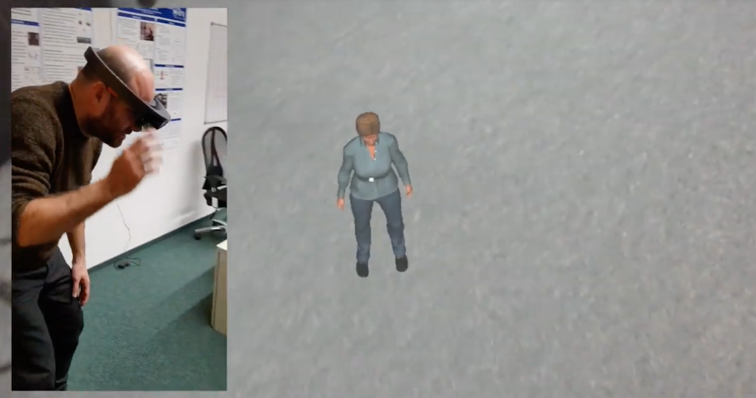

# YALLAH

YALLAH stands for **Yet Another Low-Level Agent Handler**.

## Description

YALLAH is composed of:

1. A Blender plugin (`yallah`) that takes as input virtual characters created with ManuelBastioniLab and quickly (procedurally) prepares them to run in real-time environments.
2. A Unity package (under the folder `YALLAH`) containing several motion controllers (Gaze, Locomotion, Text-to-Speech, ...) for the configuration of interactive virtual charcaters.

The goal of YALLAH is to allow 3D content creators to **generate, customize, animate, dress, and deploy a virtual human in a Game Engine in few hours of work**.

* For 3D authors, YALLAH is a reference for the development of virtual humans that have to be employed in real-time engines.
* For software developers, YALLAH is an open platform that can be taken as reference to implement new functionalities for improved interactive virtual humans.

We aim at providing a common authoring pipeline, framework, and API for the creation of multi-functional virtual humans that can be used in different application domains: video games, embodied conversational agents, virtual assistants, front-end for chat-bot systems.

## Demos

* **YALLENS** Using a YALLAH-generated character with Hololens 
  <a href="http://www.youtube.com/watch?v=LcQ5Rn45EeI" target="_blank">Youtube Video </a>
* **DECAD** (DFKI Embodied Conversational Agent Demo) at [http://decad.sb.dfki.de](http://decad.sb.dfki.de) demonstrates an online running demo of a virtual human created with YALLAH.

## Documentation

The official [YALLAH documentation](https://github.com/yallah-team/YALLAH/wiki) is maintained on the online github wiki pages.

## Video Tutorials

There are video tutorials on YouTube at the following playlist: <https://www.youtube.com/playlist?list=PL92sVNf_0lio6ilwFiAesUJ1AQO1B4ILU>

1. Character Creation in Blender <https://youtu.be/wB9baKwU9dw>
2. Import the Character in Unity <https://youtu.be/bWzclpmE3ag>
3. Configure the Motion Controllers in Unity <https://youtu.be/dD2oNAgDN7k>

## Downloads

All downloads here: [https://cloud.dfki.de/owncloud/index.php/s/WxjR8X4MH7qGtxn](https://cloud.dfki.de/owncloud/index.php/s/WxjR8X4MH7qGtxn)

* YALLAH-SDK-YYMMDD.zip contains:
  * `yallah.zip` - the Blender add-on needed to author a new virtual character.
  * `YALLAH_Unity-YYMMDD.unitypackage` - all the scripts and basic assets to run the virtual character in Unity.
  * `Wiki.zip` - all the documents: a dump of the online Wiki.
* YALLAH-Assets-YYMMDD.zip: a collection of assets to dress and animate your characters.

## Links

* The 3D authoring pipeline relies on [Blender](https://www.blender.org/).
* The character generation heavily relies on the excellent [Manuel Bastioni Laboratory](http://www.manuelbastioni.com/) character generator.
  * IMPORTANT! Towards the end of 2018, the original author dropped the development. The follow-up is called MB-Lab and is available at the following git repo: <https://github.com/animate1978/MB-Lab>.
  * The MB-Lab v1.6.1a, currently used for this project, is available for direct download at <https://cloud.dfki.de/owncloud/index.php/s/558mWyCq7BDS58t>.
* The real-time 3D rendering targets [Unity](https://unity3d.com/).
* The text-to-speech synthesis relies on the [MARY Text-to-Speech System (MaryTTS)](http://mary.dfki.de/)
* The [Haxe](https://haxe.org/) meta-programming language is used to develop some of the code.
* This project is developed at the [Sign Language Synthesis and Interation group](https://slsi.dfki.de/),
  a research group of the [German Research Center for Artificial Intelligence (DFKI)](https://www.dfki.de/)
  and funded by the [Cluster of Excellence on Multimodal Computing and Interaction (MMCI)](http://www.mmci.uni-saarland.de/) in Saarbrücken, Germany.

## People

### Current Contributors
* Fabrizio Nunnari (Research & Development)
* Alexis Heloir (Research, Testing)

### Past Contributors
* Kiarash Tamaddon (Development)
* Timo Gühring (Research & Development: text to speech, Haxe ports)
